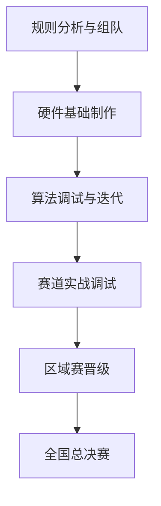

# SCMTrainer 游戏设定 - 基本规则

全国大学生智能汽车竞赛：游戏设定文档

## 1. 赛事背景与定位

全国大学生智能汽车竞赛是一项以智能汽车为载体的国家级科技创新竞赛，自 2006 年由清华大学发起首届比赛以来，至今已连续举办二十届。

赛事最初受教育部高等教育司委托创办，后被列入国家教学质量与教学改革工程资助项目，2020 年起转为由中国自动化学会主办。累计参赛人数已超过 65 万人次，覆盖全国 600 余所高校，是探索卓越工程师培养模式的重要平台。

竞赛指导思想为 “立足培养、重在参与、鼓励探索、追求卓越”。这一理念决定了该赛事在游戏中可设计为高挑战性但兼具成长容错空间的机制，适合塑造团队协作、反复试错的剧情线。

***

## 2. 赛事核心时间线 (年度周期)

游戏内可设置如下动态时间轴，驱动任务进度与角色日程（基于真实赛程压缩调整，适合游戏节奏）：

| 时间节点       | 关键事件        | 游戏内可设计的剧情 / 任务                        |
| ---------- | ----------- | ------------------------------------- |
| 前年 11 月    | 新一届竞赛规则发布   | 玩家可开始研究新组别规则，招募队友，确定技术方向              |
| 当年 3 月     | 官方报名启动      | 校内选拔赛触发，需完成组队注册                       |
| 4 月 - 6 月  | 硬件基础制作期     | 车模机械结构设计、电路板制作、传感器调试（易触发 “硬件故障” 随机事件） |
| 6 月 20 日左右 | 报名截止        | 最终参赛名单锁定，系统开始匹配区域赛对手                  |
| 7 月中下旬     | 分赛区选拔赛 (区赛) | 前往指定高校参赛，争夺全国总决赛名额                    |
| 8 月        | 全国总决赛       | 巅峰对决阶段，在承办高校（如杭州电子科技大学）举行             |

***

## 3. 赛事组别与技术演进

赛事组别设计体现了技术迭代，游戏内可设置为不同的职业路径或技能树：

### 3.1 竞速赛大类

| 序号 | 组别名称   | 赛道类型       | 核心任务要求                                                                                                                                               | 传感器配置                | 核心芯片            | 车模要求            | 团队人数       |
| -- | ------ | ---------- | ---------------------------------------------------------------------------------------------------------------------------------------------------- | -------------------- | --------------- | --------------- | ---------- |
| 1  | 飞檐走壁   | 缩微立体电磁赛道   | 1. 自制一个缩微轻量车模，采用电磁线圈导航；2. 赛道立体元素包括天花板、跷跷板等；3. 赛道道具包含直线、十字路口、直角弯道、菱形环岛、六边形环岛等元素；4. 车模是否出界由赛道旁锥桶规定                                                     | 电磁线圈、光电管、TOF         | STC             | 自制              | 三人         |
| 2  | 疯狂电路-  | 电路图赛道      | 1. 车模采用摄像头传感器导引，赛道上有电路回路，导方式为白色电路；2. 赛道中心有白色塑料棋子，车模需将其碰出赛道；3. 电路图中有绝缘区域（红色塑料棋子），车模不能触碰                                                               | 摄像头、光电管              | -               | 自制              | 四人         |
| 3  | 蚂蚁搬家   | 缩微平面赛道     | 1. 自制两个或以上缩微轻量车模，将目标物搬运到指定区域；2. 搬运物体包括球（网球、排球）、布偶、塑料模等；3. 需多个车模共同推动，物体不离开地面；4. 车模间不允许物理连接                                                            | 摄像头、光电管等             | NXP MicroPython | 自制              | 四人（TBD）    |
| 4  | 飞跃雷区   | 室内平面光标赛道   | 1. 自制一辆运行车模和一台四旋翼飞行器，在室内信标赛道完成信标检测并越障；2. 四旋翼通过线缆（≤1.5 米）与车模相连，由车模供电；3. 车模上不允许安装信标检测传感器，四旋翼可安装视觉传感器；4. 如车模设置 LED 标志，需使用英飞凌 LED 驱动芯片；5. 四旋翼制作需遵循安全要求文档 | 摄像头、光电管、TOF、IMU、其它自选 | 英飞凌 TRAVEO      | 自制              | 四人（TBD）    |
| 5  | -走马观碑  | 室内赛道       | 1. 车模在室内赛道运行；2. 赛道元素包括直道、弯道、路口、环道、中心路障等；3. 赛道旁有目标板（液晶），车模需向其发送数据；4. 车模需在锥桶内侧运行，无锥桶处按规则行驶                                                             | -                    | -               | -               | -          |
| 6  | 雁过留痕   | 室内 PVC 赛道  | 1. 制作一辆四轮竞速车模，在赛道运行一周；2. 赛道元素包括直道、弯道、路口、环岛、坡道、中心路障等；3. 特定路段有紫色区域，车模需用紫外激光管照射留下痕迹，区域外不允许留痕                                                            | 摄像头（仅限一个）            | STC             | 四轮车模 B、C        | 三人（本科专科分开） |
| 7  | 人工智能视觉 | 室内平面虚拟现实赛道 | 1. 制作一个车模完成推箱子游戏（待定）；2. 车模顶部有标识牌，便于全局摄像头识别位置和方向；3. 任务详见相关文档                                                                                          | 摄像头                  | NXP             | 四轮、三轮、麦克纳姆轮、福来轮 | 四人         |
| 8  | 人工智能完模 | 室内平面虚拟现实赛道 | 1. 制作一个四轮车模完成复杂环境下目标搜寻和路径规划（待定）；2. 车模顶部有标识牌，便于全局摄像头识别位置和方向；3. 任务详见相关文档                                                                               | 摄像头、其它自选             | 百度 EdgeBoard    | 四轮车模            | 四人         |
| 9  | 卡丁快跑   | 室外操场赛道     | 1. 制作一辆可载人车模，完成全部或部分科目；2. 科目 1：基础任务（自动出车、绕桩、自动泊车）；3. 科目 2：如影随形（跟随人通过复杂环境）；4. 科目 3：战场救护（语音指令运送伤员，避开障碍）；5. 科目 4：载人过迷宫（先人工驾驶，后自主通过）                     | 摄像头、GPS              | 英飞凌 TC4         | 卡丁 1、卡丁 2       | 五人         |
| 10 | 轮腿穿越-  | 室外赛道       | 1. 车模完成全部或部分科目；2. 科目 1：往返绕桩（直道和绕桩）；3. 科目 2：定点排雷（GPS 和视觉定位后移动）；4. 科目 3：颠簸路段（单边桥、颠簸路、草地）；5. 科目 4：鲤鱼跃龙门（坡道）                                             | -                    | -               | -               | -          |
| 11 | 单车定向   | 室外操场赛道     | 1. 制作一辆电动单车，完成全部或部分科目；2. 科目 1：往返直线竞速；3. 科目 2：八字慢速运行；4. 科目 3：颠簸路段（坡道、草地、颠簸路）；5. 科目 4：无线导航（电磁传感器通过信标拱门）                                                | 摄像头、GPS、电磁线圈         | 英飞凌 AURIX       | 单车（新旧版本均可）      | 三人         |

***

## 4. 备赛流程与团队协作

### 4.1 阶段化备赛流程 (游戏任务链设计)

* 阶段一（规则分析）：研究新赛季规则，确定组别与技术方案

* 阶段二（硬件制作）：设计 PCB 板、3D 打印结构件、组装车模

* 阶段三（算法调试）：编写控制算法（如 PID 控制器）、图像识别模型

* 阶段四（实战调试）：在不同光照 / 赛道条件下测试，优化参数

### 4.2 团队分工与技能配置 (游戏角色职业设计)

* 硬件组（2 人）：精通 PCB 设计（Altium Designer）、3D 建模（碳纤维减重方案）、传感器电路调校

* 算法组（2 人）：掌握 C 语言手撕代码能力、Matlab 仿真、PID 控制算法（位置式 / 增量式 / 模糊 PID）、Python 参数调优

* 机械组（1 人）：负责 ANSYS 结构仿真、加工工艺、车体配平与惯性力矩优化

***

## 5. 赛事规则与竞技特色

### 5.1 核心规则 (游戏机制基础)

* 成绩计算：最终成绩 = 最快单圈时间 × (1 - 技术报告得分 × 0.01)

* 关键限制：

1. 除更换电池外，比赛现场不得修改硬件 / 软件

2. 禁止安装辅助照明或外部传感器

3. 每队仅允许 1 名队员进入比赛场地操作

### 5.2 赛事文化特色 (游戏世界观氛围)

* 高强度的备赛氛围：熬夜调试、通宵测试是常态，实验室成为第二宿舍

* 团队协作模式：采用 Git 代码管理、腾讯文档协同、每日站会制度

* 晋级体系：区域赛 - 全国赛，涵盖东北、华北、华东、华南、西部五大赛区，以及安徽、山东、浙江、新疆四个独立省赛区

* 交流机制：学校间线上线下多渠道交流

## 6.SCMTrainer游戏设定-技术挑战
全国大学生智能汽车竞赛的核心魅力，就在于它用一个具体的“让小车跑起来”的任务，巧妙地串联起了一系列硬核且前沿的技术挑战。下面这个流程图帮你快速了解这些挑战是如何环环相扣的：
flowchart TD
    A[智能汽车竞赛核心挑战] --> B[硬件设计与集成]
    A --> C[环境感知与识别]
    A --> D[运动规划与控制]
    A --> E[系统集成与优化]
    
    B --> B1[主控芯片选型与电路设计]
    B --> B2[机械结构设计与执行器控制]
    
    C --> C1[赛道元素识别]
    C --> C2[多传感器融合]
    
    D --> D1[路径规划]
    D --> D2[运动控制算法]
    
    E --> E1[软硬件协同]
    E --> E2[稳定性与抗干扰]
    E --> E3[算法效率与实时性]

Mermaid

接下来，我们详细拆解这些挑战的具体内容。
🔧 硬件设计与集成
硬件是智能车的基础，首先面临的挑战是主控芯片（MCU）的选型与电路设计。你需要为车模选择一个合适的“大脑”，并为其设计稳定的“神经网络”（电路系统）。这要求你熟悉不同微控制器（如沁恒、英飞凌、NXP等品牌的产品）的特性，并能够设计可靠的传感器采集电路和电机驱动电路。
其次是机械结构设计与执行器控制。不同的车模结构（如四轮、麦克纳姆轮、气垫等）和不同的赛道条件，对车辆的运动性能有着决定性的影响。例如，采用麦克纳姆轮的车模可以实现全向移动，但其速度解算和控制算法更为复杂。机械部分的调整（如重心分配）与电路设计需要同步考虑，即“硬件-机械同步融合设计”。
👀 环境感知与识别
智能车需要“看见”并“理解”周围环境。核心挑战在于赛道元素的精准识别。车模需要通过传感器（如摄像头、电磁传感器、激光雷达等）识别赛道边界、中心线、交叉口、障碍物等元素。特别是对于“视觉组”或使用摄像头的队伍，需要处理图像识别任务，例如在复杂光照条件下稳定地识别车道线。
当车模配备多种传感器时，就产生了多传感器信息融合的挑战。例如，可能需要融合激光雷达的点云数据和摄像头的图像数据，以更全面地感知环境。BEV（鸟瞰图）感知等前沿技术也被引入，用于构建车辆周围环境的统一视角。这要求算法能够有效处理不同传感器在数据格式、时空对齐上的差异。
🧠 运动规划与控制
感知到环境信息后，智能车需要规划并执行动作。路径规划与决策是关键一环，车模需要根据感知信息规划出最优行驶路径，并在复杂场景（如弯道、障碍区）做出正确决策（如选择超车时机和路径）。在创意赛中，任务可能更复杂，例如要求多车进行协同侦察与编队。
车辆的运动控制依赖于核心控制算法，最典型的是PID控制算法及其变种（如模糊PID）。参数整定不佳会导致车辆运行不稳定。此外，也可能涉及更先进的算法，如模型预测控制（MPC） 或结合深度学习的端到端控制模型。
⚙️ 系统集成与优化
将各个模块有效整合并优化，是最终成功的保障。软硬件协同与稳定性至关重要。智能车是一个复杂的嵌入式系统，需要确保软件算法与硬件平台高效、稳定地协同工作。在长时间、高强度的比赛中，硬件系统的热管理和软件运行的稳定性是重要挑战。
车模在赛场上会遇到各种实时性与效率的挑战。例如，图像处理等计算任务对微控制器的算力要求高，需要在有限的资源下进行算法优化，确保系统实时响应。一些队伍可能会采用多处理器方案来分担计算压力。
